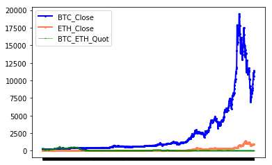
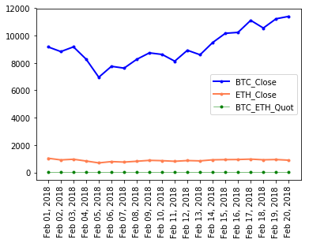
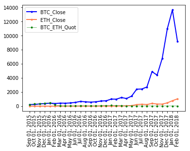

# Project_Crypto

ETL Project Report 10/20/2018
 
Part 1: Finding a Topic:
 
When embarking on our research on a project idea, all three of us were interested in the “crypto-sphere” and learning more about the historical pricing. At first, we were interested in Bitcoin and seeing how the price per cryptocurrency went up the last couple of years, and wanted to compare it to its main competitor Ethereum. We wanted to see if there was any correlation in historical pricing. Questions such as the following arise: If Bitcoin goes up, does Ethereum go up as well, or is there a reverse trend?
 
Part 2: Finding and Extracting the Data Sets:
 
We explored numerous data sets on Google's dataset search (https://toolbox.google.com/datasetsearch) and other sources. Ultimately, we were able to find two strong CSV files for both Bitcoin and Ethereum (https://www.kaggle.com/sudalairajkumar/cryptocurrencypricehistory).

We were able to successfully download both CSV files, save them to our Resources Folder, and load the data into our Pandas DataFrames, accessible via Jupyter Notebooks. Our next step was to transform the dataset and obtain only the data we need.
 
Part 3: Transforming the Data:
When examining our DataFrame and going through the columns, we came to the conclusion that all we needed for Bitcoin and Ethereum historical pricing were the “Close” prices, where the coin would close at the end of the day, as well as the corresponding date.
 
Moreover, since Bitcoin had been around longer, there were more rows of data available. Therefore, we performed an .LOC to reduce the Bitcoin dataset to the same date range as Ethereum's dataset. Thus, both Bitcoin and Ethereum had the same number of rows of data.

This graph displays the overall dataset:

This graph displays the dataset spanning February 2018:

This graph displays the dataset consisting of the first of each month in the dataset:

Lastly, to spice things up, we recalled Bitcoin and Ethereum had ticker abbreviations, so we modified a class example (Doctor Decoder) to scrape the Bitcoin and Ethereum abbreviations from the Wikipedia page for cryptocurrencies.
 
Part 4: Loading the Data:
 
After we extracted and transformed our dataset, we created an engine connection with MySQL to load and save the dataset there. We were able to successfully load the data and performed an inner join on the date to display a single table with both the Bitcoin and Ethereum closing prices.
 
Part 5: Creating an API with Flask

After we performed the ETL, we created an API via Flask with multiple routes, one which displayed the Bitcoin and Ethereum data, and another which took averages of Bitcoin and Ethereum close prices over a date range.
